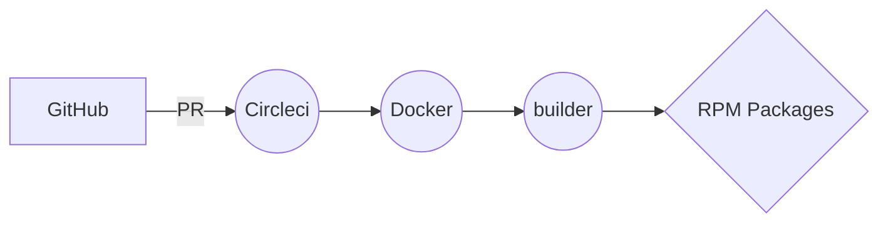

# automated rpm builder repository

## the repository
This is an automated RPM package builder repository.

You can build RPM packages for Fedora, Centos, RockyLinux and RedHat.
It builds your package and test it in an isolated environment.

This repository uses, docker containers, mock, rpmbuild, dockerhub, and circleci.

## how to use it
To build a package, place your spec files or a repository under the *packages/* directory. Just follow the examples available in the repository.

A PR will build your package and let it available for download. Having a PR merged will deploy that package to these repositories [1].

If you build a Rocky Linux 8 package (el8), the repository will spin up an el8 environment, build and install the package. 

All the logs from the build procedure will be avaialble.

## fork it, clone it, update it
Feel free to fork, clone, and chage this repo to fit your needs. 
This is specially handy for companies that want to build their own packages.

If you want to use it in your company, don't forget to create a docker hub and a circleci accounts.

The docker image used by this repository can be found, forked or cloned from here [2].
  
1  
2 https://github.com/spideyz0r/rpmbuilder-base-image.

## todo 
- add the deploy step and push the built package to the according repository
